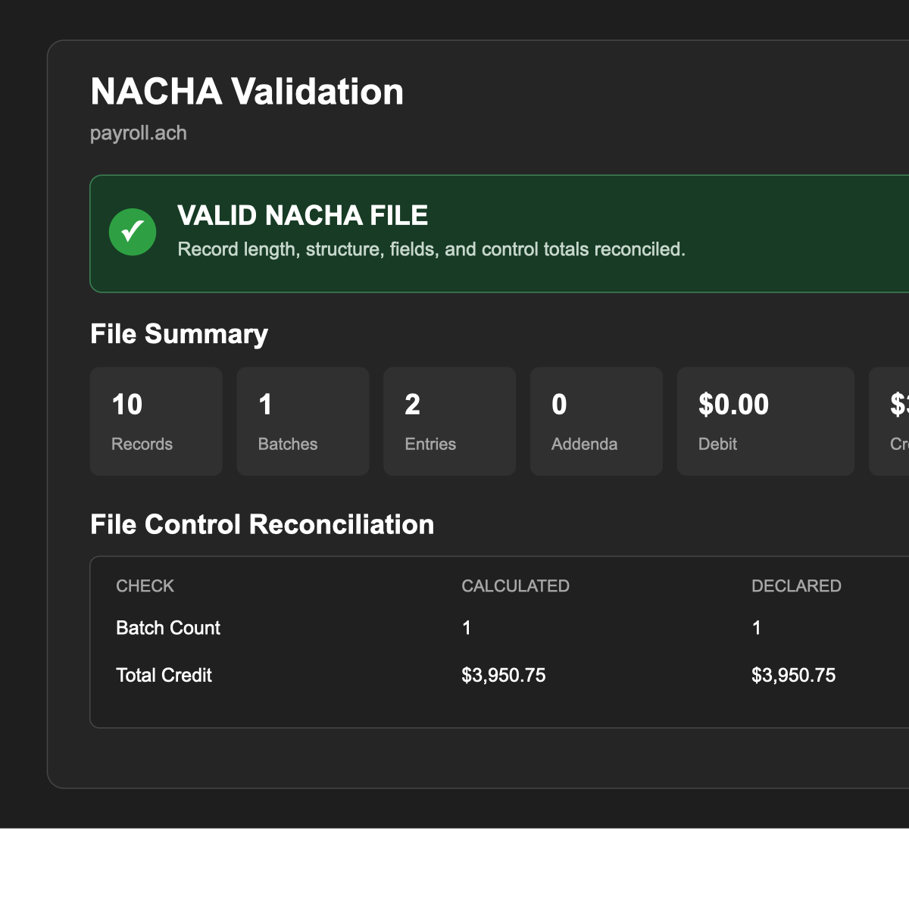

# NACHA Validator

NACHA Validator is a Visual Studio Code extension for inspecting an ACH/NACHA file before it moves to the next stage of a payment workflow. It turns fixed-width records into a practical review: totals, batch details, masked entry data, control reconciliation, and actionable validation issues.

> This extension validates the checks documented below. It is **not** a claim of complete compliance with the Nacha Operating Rules, bank-specific specifications, or every SEC-specific rule.



## Who it helps

- **Developers** can validate generated ACH files locally, diagnose a control-total mismatch, and extend the modular parser/analyzer/validator code.
- **QA analysts** can quickly compare expected entry counts, hashes, credits, debits, and batch controls without manually counting 94-character records.
- **Payments and operations teams** get a readable file and batch summary while account numbers remain masked in the results view.
- **Business users** can review company names, SEC codes, settlement dates, payment descriptions, and gross/net totals without reading raw fixed-width positions.

## What the validator checks

### File and record integrity

- Every physical record is exactly 94 characters.
- The file starts with a File Header, batches open and close in order, entries stay inside batches, addenda follow entries, and a File Control record is present before padding.
- File Header constants: Priority Code `01`, Record Size `094`, Blocking Factor `10`, and Format Code `1`.
- File Control batch count, block count, entry/addenda count, entry hash, debit total, and credit total reconcile to the calculated values.

### Batch and entry integrity

- Batch Control entry/addenda count, entry hash, debit total, credit total, company ID, service class, ODFI ID, and batch number reconcile to the batch.
- Receiving DFI routing numbers are checked using the ABA check-digit calculation.
- Trace numbers are checked for an ODFI prefix match and reported when they are not ascending inside a batch.
- Common transaction codes are classified explicitly as credit, debit, or unknown; unknown codes are never silently counted as money movement.
- Addenda are associated with their entry. Common PPD, CCD, and WEB one-addenda behavior, TEL’s no-addenda rule, Type Code `05`, and addenda sequencing are checked.
- Recognized SEC codes include ARC, BOC, CCD, CIE, CTX, IAT, POP, POS, PPD, RCK, TEL, and WEB. Unknown SEC codes produce an advisory instead of a false assertion of compliance.

The checks draw on the [Nacha ACH File Details guide](https://achdevguide.nacha.org/ach-file-details): its file-control fields, batch-control fields, record-size/blocking constants, SEC descriptions, routing/check-digit placement, and common addenda behavior.

## Using the extension

1. Open a NACHA text file in VS Code. Each physical line should be one ACH record; do not wrap records.
2. Open the Command Palette with `Ctrl+Shift+P` (Windows/Linux) or `Cmd+Shift+P` (macOS).
3. Choose **NACHA Validator: Validate NACHA File**.
4. The results panel opens beside the editor. Start with the overall status, then inspect:
   - **File Summary** for records, batches, entries, addenda, debit, credit, gross, and net amounts.
   - **File Control Reconciliation** for calculated versus declared values.
   - **Batches** for collapsible company/SEC metadata, totals, and Batch Control comparisons.
   - **Entries** for line number, trace, transaction class, amount, Receiving DFI, masked account, individual ID/name, and addenda count/indicator.
   - **Validation Issues** for severity, line/context, explanation, and expected/actual values where relevant.
5. Correct the source record, then run the command again. The extension is intentionally read-only: it never alters ACH data.

### Reading the status

`VALID NACHA FILE` means the implemented checks completed with no errors. Warnings can still call out an unknown SEC code or a non-ascending trace number.

`INVALID NACHA FILE` means at least one implemented error check failed. For example, an invalid routing check digit, an unmatched control total, a 93-character record, or an addenda record in a TEL batch will produce an error.

## Privacy and safety

The entry table masks DFI account numbers, leaving only the last four characters visible. The raw file remains open in your editor, so treat source ACH files as sensitive data and follow your organization’s data-handling policy. The extension does not transmit the file or its contents.

## Deliberately out of scope

This is an analysis and validation aid, not a complete NACHA Rules engine. It does not yet implement all SEC-specific field requirements, IAT layouts, authorization evidence, date/calendar rules, return/NOC rules, bank/ODFI requirements, addenda formats such as TXP or ANSI X12, or operational submission rules.

## Ideas for the next releases

The strongest next steps would make this useful across development, QA, and payment operations without overstating compliance:

- **Inline diagnostics and quick navigation:** publish validation findings as VS Code Problems with a click back to the precise field.
- **File comparison / regression mode:** compare two ACH files by batch, trace number, totals, and field differences; ideal for QA fixtures and release testing.
- **CI-friendly validator:** provide a Node CLI and GitHub Actions example that fails a build on configured error severities.
- **Configurable policy profiles:** let an organization select allowed SEC codes, expected Company IDs/ODFI IDs, transaction-code allowlists, and strict-versus-advisory rules through workspace settings.
- **SEC-aware rules:** incrementally add PPD, CCD, WEB, TEL, CTX, and IAT profiles, each labelled with the exact scope implemented.
- **Payment-risk dashboard:** flag unusual amount distributions, duplicate trace numbers, duplicate files (header/date/modifier fingerprints), unexpected counterparty changes, and out-of-policy settlement dates as advisories.
- **Safe sample and fixture generator:** generate synthetic, fully masked examples with internally consistent controls for developers and QA. Never use production account data.
- **Explain mode:** make each issue link to the record position, the calculation used, and a concise remediation suggestion.

## Development

The implementation intentionally separates concerns:

```text
src/analysis/      file grouping, totals, hashes, classifications, amount formatting
src/parser/        reusable fixed-width record parsing and field definitions
src/validation/    record length, structure, and common field-level checks
src/ui/            results presentation only
src/language/      hover and semantic highlighting
src/commands/      VS Code command orchestration
```

Run the checks locally:

```bash
npm run compile
npm run lint
npm test
```

## Version

Current version: `0.0.1`. The version is intentionally unchanged while this enhancement is being verified.
